<h3><code>mehmet@github ~ $ ./contributions.sh</code></h3>

<h3><code>mehmet@github ~ $ ./snake.sh</code></h3>

<h3><code>mehmet@github ~ $ whoami</code></h3>
<table>
  <tr>
    <td valign="top"></td>
    <td valign="top"></td>
  </tr>
</table>

<h3><code>mehmet@github ~ $ ls skills/ && cat focus.txt</code></h3>

  
<code>mehmet@github ~ $ exit</code> — connection to github closed.

